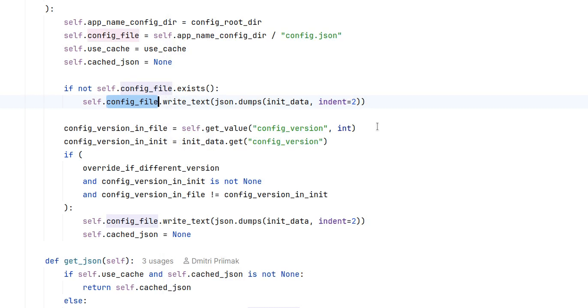

# Current Project Switcher

[plugin-version-svg]: https://img.shields.io/jetbrains/plugin/v/34684-current-project-switcher.svg
[plugin-repo]: https://plugins.jetbrains.com/plugin/34684-current-project-switcher

[![JetBrains plugins][plugin-version-svg]][plugin-repo]

A minimal project switcher plugin for IntelliJ and derived IDEs.
Unlike default or other third party project switcher plugins it 
switches only between already opened projects. It is absolutely minimal. 
When activated there are no colors or icons associated with available projects, 
just their names. You can do a dynamic case-insensitive search for project 
by some substring. Pressing `Enter` on keyboard closes the dialog and switches 
to the selected project. You can also use Up and Down arrow keys to navigate 
the list. Alternatively you can use mouse by double-clicking on the project
to switch to.

By the default when this plugin is installed it is bound to `Alt-P` `Alt-P` 
combination, i.e. hold `Alt` and press `P` key twice to activate it. 

